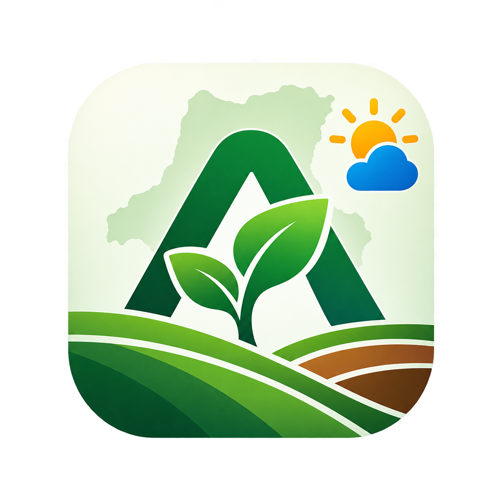
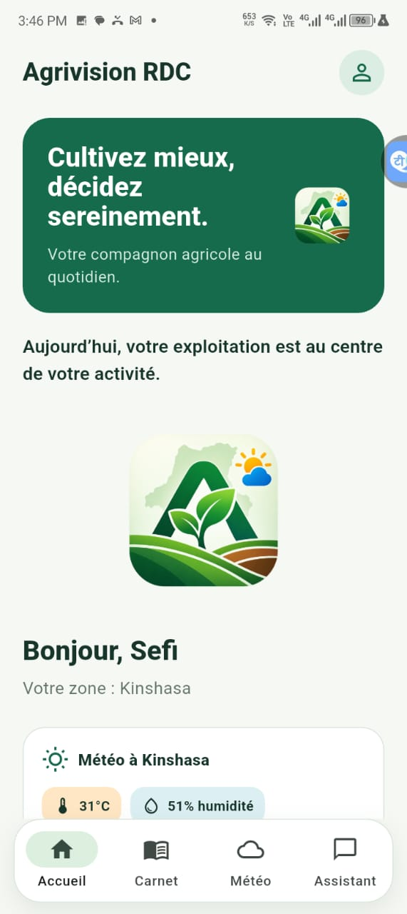
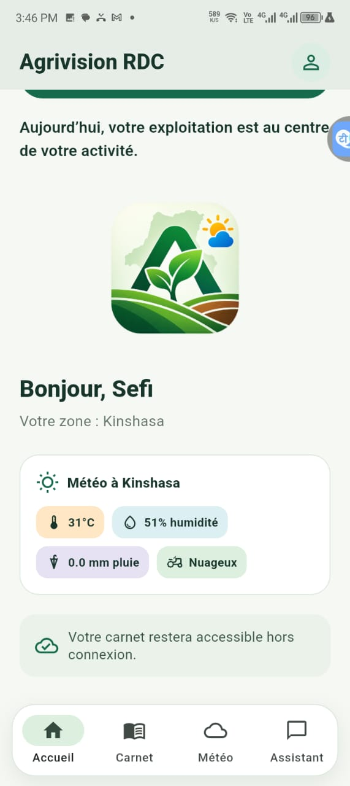
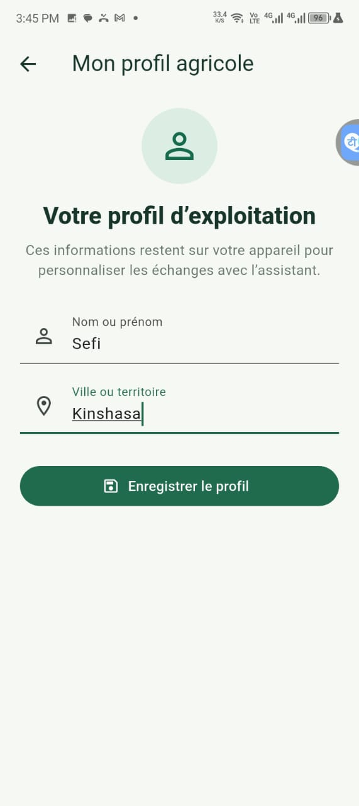
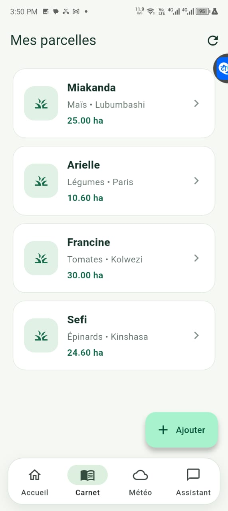
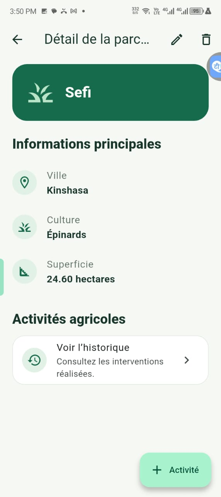

# Agrivision RDC

## Objectif

Agrivision RDC est une application mobile Flutter d'aide à la gestion des cultures destinée aux petits exploitants de la République démocratique du Congo. Elle centralise le suivi des parcelles, les activités agricoles, la météo locale et des conseils agricoles en français.

## Fonctionnalités principales

- Gestion d'un profil agricole : nom et  ville de l'agriculteur.
- Carnet agricole hors connexion : création, modification et suppression de parcelles et de leurs activités.
- Consultation des conditions météorologiques actuelles et de prévisions pour une ville donnée.
- Assistant agricole basé sur Gemini, avec prise en compte de l'historique récent de la conversation.
- Accueil personnalisé avec la météo de la ville renseignée dans le profil.
- Navigation entre l'accueil, le carnet, la météo et l'assistant.

## Technologies et packages utilisés

- Flutter et Dart
- `provider` : gestion d'état
- `sqflite` et `path` : base de données SQLite locale
- `shared_preferences` : persistance du profil agricole
- `http` : appels aux API OpenWeatherMap et Gemini
- `intl` : formatage des dates et informations localisées
- `flutter_launcher_icons` : génération des icônes de l'application
- `flutter_test` et `flutter_lints` : tests et qualité du code

## Installation

### Prérequis

- Flutter stable et un SDK Dart compatible (le projet requiert Dart `^3.12.0`).
- Android Studio ou un environnement Flutter configuré avec un émulateur ou un appareil mobile.
- Une clé API OpenWeatherMap et une clé API Gemini pour utiliser la météo et l'assistant.

Clonez le dépôt, placez-vous à sa racine, puis installez les dépendances :

```powershell
flutter pub get
```

Les clés API ne doivent jamais être ajoutées au code source ni au dépôt Git.

## Lancement de l’application

Vérifiez qu'un appareil ou un émulateur est disponible :

```powershell
flutter devices
```

Lancez ensuite l'application en transmettant les clés au démarrage :

```powershell
flutter run --dart-define=OPENWEATHER_API_KEY=votre_cle_openweathermap --dart-define=GEMINI_API_KEY=votre_cle_gemini
```

En cas de problème de cache, exécutez `flutter clean`, puis `flutter pub get` avant de relancer la commande.

## Tests réalisés

Les tests couvrent notamment :

- Le parsing des données météo et le traitement d'une ville introuvable.
- Les réponses Gemini, les erreurs de clé et le basculement vers un modèle compatible.
- Le chargement et l'enregistrement du profil agricole.
- Les cycles de création, modification et suppression des parcelles et activités.
- Les principaux parcours de l'interface : navigation, profil, carnet et assistant.

Pour les exécuter :

```powershell
flutter analyze
flutter test
```

## Image de l'icône

Icône de l'application :



## Ecran de l'application

Captures d'écrans :

<p align="center">
  
  
  
</p>


<p align="center">
  
  
  
</p>

<p align="center">
  
  
  
</p>

## Difficultés rencontrées

- Protéger les clés des services externes en les injectant avec `--dart-define` plutôt qu'en les stockant dans le projet.
- Prévoir l'indisponibilité de certains modèles Gemini : l'application essaie successivement plusieurs modèles compatibles.
- Conserver l'accès au carnet agricole sans connexion grâce à SQLite, tout en distinguant les fonctionnalités qui nécessitent Internet, comme la météo et l'assistant.
- Gérer proprement les erreurs réseau, les clés invalides et les villes non trouvées pour fournir des messages compréhensibles à l'utilisateur.

## Auteur

Fidèle Miakanda
